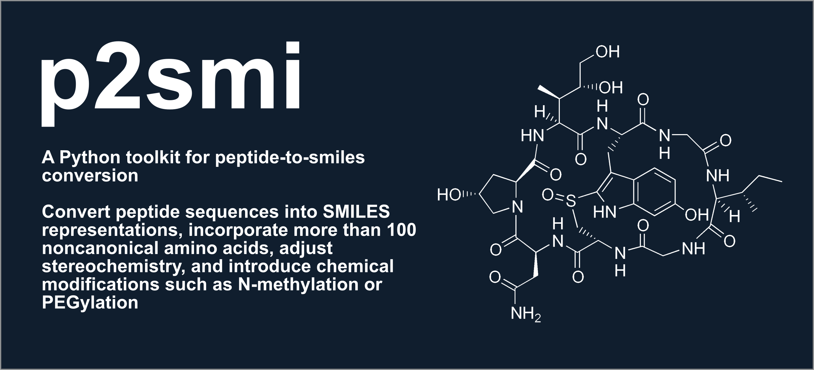

# p2smi: Generation and Analysis of Drug-like Peptide SMILES Strings

**p2smi** is a Python toolkit for peptide design and analysis. 

It enables generation of peptide sequences, conversion to SMILES representations—including support for cyclic and noncanonical amino acids—and evaluation of molecular properties. The package also provides utilities for structural modification (e.g., N-methylation, PEGylation), synthesis feasibility assessment, and output in a dedicated .p2smi format that links peptide sequences to their corresponding SMILES.

This was developed in support of [PeptideCLM](https://pubs.acs.org/doi/10.1021/acs.jcim.4c01441), a SMILES-based language model for modified peptides, p2smi provides an extensible foundation for computational peptide chemistry and machine-learning-driven molecular design.

If you use this tool, please cite our paper at the link below:

[](https://doi.org/10.21105/joss.08319)

## Features

- Convert peptide FASTA files into valid SMILES strings
- Support five cyclization types: disulfide, head-to-tail, sidechain-to-sidechain, sidechain-to-N-term, sidechain-to-C-term
- Apply random library modifications or deterministic, site-explicit recipes
- Generate random peptide sequences (with modification rates)
- Evaluate synthetic feasibility based on common failure motifs
- Compute molecular properties (MW, logP, TPSA, Lipinski, etc.)

## Updates
- Version 2.0.1 - Fixed CLI loading of residue and modifier registry paths
- Version 2.0.0 - Added JSON residue registries, NCAA import from SMILES or MOL
  files, SMARTS/graph peptide assembly, and registry-aware FASTA conversion
- Version 1.1.1 - Added functionality to allow for user-defined cyclizing residue constraints
- Version 1.1.0 - Updated codebase, documentation, fixed bugs -- for JOSS review
- Version 1.0.0 - First release for JOSS submission

## Manuscript
- [PDF](manuscript/paper.pdf) | [Markdown](manuscript/paper.md)


## Directory

- [Installation](#installation)
- [Command-Line Tools](#command-line-tools)
- [Example Usage](#example-usage)
- [Future Work](#future-work)
- [Contributing](#for-contributors)
- [License](#license)


## Installation

Install from PyPI:

```bash
pip install p2smi
```

For local development:

```bash
git clone https://github.com/AaronFeller/p2smi.git
cd p2smi
pip install -e .[dev]
```


## Command-Line Tools

| Command             | Description |
|-------------------------|-------------------------------------------------------------------------------------------------------------------------|
| `add-amino-acid`        | **Summary:** Validates and adds a noncanonical amino acid to a versioned JSON residue registry.<br>**Input:** Stable ID, name, and either base SMILES or an MDL MOL file. Optional code and one-character aliases support legacy sequences.<br>**Output:** Creates or extends a user-owned registry containing the canonical base structure; cyclization sites are derived from the molecular graph. |
| `import-lipid-modifiers` | **Summary:** Imports selected fatty acids from SDF or MOL files as reusable amine-acylation modifiers.<br>**Input:** Monoacids or symmetric diacids, limited to 20 carbons by default.<br>**Output:** A strict JSON modifier registry that can be edited or extended. |
| `generate-peptides`.    | **Summary:** Generates random peptide sequences with user-defined constraints including number of sequences, length range, NCAA percentage, D-stereochemistry rate, and cyclization types. Supports over 100 noncanonical amino acids (SwissSidechain).<br>**Input:** CLI arguments for generation settings and output filename.<br>**Output:** FASTA file with single-letter codes, including noncanonical residues. |
| `fasta2smi`             | **Summary:** Converts peptide sequences from FASTA format into SMILES, parsing cyclization tags from the FASTA header.<br>**Note:** Supports five cyclization types: disulfide (SS), head-to-tail (HT), sidechain-to-sidechain (SCSC), sidechain-to-head (SCNT), and sidechain-to-tail (SCCT). To define specific cyclizations, include notation in fasta file as described in the next section below.<br>**Input:** Peptide FASTA file, optional cyclization tags.<br>**Output:** `.p2smi` file containing amino acid sequence, cyclization type, and SMILES string. |
| `modify-smiles`         | **Summary:** Applies either rate-based random N-methylation/mPEG acylation or deterministic JSON recipes.<br>**Input:** Plaintext SMILES or `.p2smi`, plus rates or a modifier registry and recipe ID.<br>**Output:** Modified SMILES with applied modifications recorded in the label. |
| `smiles-props`          | **Summary:** Computes a wide range of molecular properties from SMILES, including MW, TPSA, logP, H-bond donors/acceptors, rotatable bonds, ring count, fraction Csp3, heavy atoms, formal charge, molecular formula, and Lipinski rule evaluation. Batch mode can optionally preserve `id: SMILES` labels as JSON `ID` fields and can run in strict mode for invalid input handling.<br>**Input:** SMILES text file or `.p2smi` file.<br>**Output:** JSON-formatted text file with calculated properties for each SMILES. |
| `synthesis-check`       | **Summary:** Evaluates peptide sequences for synthetic feasibility using configurable filters (e.g., N/Q at N-terminus, Gly/Pro motifs, Cys count, hydrophobicity, charge distribution). Thresholds such as maximum cysteines, glycine run length, logP cutoff, charge window, and maximum length are exposed as CLI flags. Currently supports natural amino acids only.<br>**Input:** FASTA file.<br>**Output:** FASTA file with headers annotated as PASS/FAIL. |

Use `--help` on any command for options:
```bash
fasta2smi --help
```

## Manually encoding cyclizations

Cyclizations can be specified directly in the FASTA header to control how fasta2smi interprets bond formation between residues.

Each cyclization tag begins with a two-letter code identifying the bond type (SS or SC), followed by a constraint mask of equal length to the peptide sequence, where:

- X marks positions left unconstrained
- C marks residues participating in a disulphide bond
- N marks nucleophilic sidechains that cyclize to the peptide C-terminus
- E marks ester sidechains that cyclize to the peptide C-terminus
- Z marks carboxyl sidechains that cyclize to the peptide N-terminus
- if N and Z included, form side-chain to side-chain cyclization

### Supported Formats:

| Tag | Type | Description | Example header|
|------|------|-------------|----------|
| `SS` | Disulfide | Connects two cysteine residues | `>peptide\|SSXXXCXXXCX` |
| `HT` | Head-to-tail | Amide bond between N- and C-termini | `>peptide\|HT` |
| `SCSC` | Sidechain–Sidechain | Covalent link between two sidechains (e.g., Lys–Asp lactam) | `>peptide\|SCXXNXXXXXZ` |
| `SCNT` | Sidechain–N-Terminus | Link between N-terminus and a sidechain residue | `>peptide\|SCXXXXXZXXX` |
| `SCCT` | Sidechain–C-Terminus | Link between a sidechain residue and C-terminus | `>peptide\|SCXXNXXXXXX` |


## Example Usage

### Generate random peptides with constraints:

```bash
generate-peptides \
  --num 10 \
  --min_length 10 \
  --max_length 20 \
  --noncanonical 0.1 \
  --dextro 0.1 \
  --cyclization_constraints all \
  --outfile peptides.fasta
```

### Add a noncanonical amino acid to a v2 registry:

```bash
add-amino-acid \
  --registry-file lab-residues.json \
  --id LAB_001 \
  --name "Example NCAA" \
  --smiles "N[C@@H](CC)C(=O)O"
```

When only an MDL `.mol` structure file is available, replace `--smiles` with
`--mol-file path/to/residue.mol`. The command validates the structure and stores
its canonical isomeric SMILES in the JSON registry.

Cyclization uses SMARTS assembly and graph-derived sidechain reaction sites; do
not provide separate cyclization SMILES. A constrained v2 peptide must select
exactly one compatible site per marked residue. Structures with multiple
matching cyclization sites are rejected rather than selected arbitrarily.

Use comma-delimited residue IDs in FASTA and pass the same registry when
converting:

```bash
cat > custom.fasta <<'EOF'
>custom|SCCT
LAB_001,Ala,Ala,Ala
EOF

fasta2smi -i custom.fasta -o custom.p2smi --registry-file lab-residues.json
```

### Convert FASTA to SMILES:

```bash
fasta2smi -i peptides.fasta -o peptides.p2smi
```

### Modify SMILES strings:

Random library generation retains rate-based controls. Random PEGylation
creates a defined mPEG acyl conjugate at a free amine:

```bash
modify-smiles -i peptides.p2smi -o modified.p2smi --peg_rate 0.2 --nmeth_rate 0.2 --nmeth_residues 0.2
```

### Build explicitly modified peptides

Deterministic recipes select termini, chemical roles, residue positions, atom
indices, or SMARTS matches. Residue numbers are one-based. Residue-scoped steps
run before peptide assembly; terminal/global steps follow them.

```json
{
  "schema_version": 1,
  "kind": "p2smi_modifier_registry",
  "modifiers": [],
  "recipes": [
    {
      "id": "lipidated_candidate",
      "steps": [
        {
          "modifier": "octadecanedioyl",
          "site": {"residue": 2, "role": "sidechain_amine"},
          "params": {"linker": "gamma_glu_aeea2"}
        },
        {
          "modifier": "n_methyl",
          "site": {"residue": 3, "role": "backbone_n"}
        },
        {
          "modifier": "c_amide",
          "site": {"terminus": "C"}
        }
      ]
    }
  ]
}
```

Apply residue-addressed recipes during sequence assembly:

```bash
fasta2smi \
  -i candidate.fasta \
  -o candidate.p2smi \
  --modifier-registry modifiers.json \
  --recipe lipidated_candidate
```

Apply recipes using terminal, role, atom-index, or SMARTS selectors to existing
SMILES:

```bash
modify-smiles \
  -i peptides.p2smi \
  -o modified.p2smi \
  --modifier-registry modifiers.json \
  --recipe terminal_caps
```

Supported semantic roles are `n_terminal_amine`, `c_terminal_carboxyl`,
`backbone_n`, `backbone_amide_n`, `sidechain_amine`,
`sidechain_hydroxyl`, and `sidechain_thiol`. Selector examples:

```json
{"terminus": "N"}
{"residue": 4, "role": "sidechain_amine"}
{"residue": 3, "smarts": "[O;H1]", "match_index": 1}
{"atom_index": 12}
{"smarts": "[S;H1]"}
```

An `atom_index` refers to the original input graph and fails if an earlier step
removes that atom. SMARTS selectors must match exactly once unless
`match_index` is provided. Explicit selectors must still satisfy the
modifier's allowed chemistry.

Built-in modifiers are:

| ID | Product |
|----|---------|
| `n_methyl` | Backbone amide N-methylation |
| `n_acetyl` | N-terminal acetylation |
| `c_amide` | C-terminal amidation |
| `mpeg_acetyl` | Amine-linked mPEG acylation; requires `{"units": N}` |
| `octanoyl`, `decanoyl`, `dodecanoyl`, `tetradecanoyl` | Linear C8-C14 monoacid acylation |
| `palmitoyl`, `stearoyl`, `eicosanoyl` | Linear C16, C18, or C20 monoacid acylation |
| `hexadecanedioyl`, `octadecanedioyl`, `icosanedioyl` | C16, C18, or C20 diacid monoacylation; retains the distal acid |
| `carbamidomethyl` | Thiol carbamidomethylation |
| `phosphoryl` | Sidechain hydroxyl phosphorylation |
| `azidoacetyl`, `propiolyl` | Amine-linked click handles |

#### Lipid linkers

Any acyl modifier whose fragment ends in `C(=O)*`, including imported LMSD
monoacids, can be applied through a linker:

```json
{
  "modifier": "octadecanedioyl",
  "site": {"residue": 26, "role": "sidechain_amine"},
  "params": {"linker": "gamma_glu_aeea2"}
}
```

Available linker IDs are:

| ID | Structure between peptide amine and lipid cargo |
|----|-------------------------------------------------|
| `aeea` | One 8-amino-3,6-dioxaoctanoic acid spacer |
| `aeea2` | Two AEEA spacers |
| `gamma_glu` | A gamma-L-glutamyl spacer |
| `gamma_glu_aeea` | Gamma-L-Glu followed by one AEEA spacer |
| `gamma_glu_aeea2` | Gamma-L-Glu followed by two AEEA spacers |

These building blocks cover several literature-studied architectures. A C16
acyl cargo with `gamma_glu` gives a liraglutide-like side chain. The C18 or C20
diacid cargos with `gamma_glu_aeea2` give semaglutide-type or tirzepatide-type
hydrophilic lipid side chains, respectively. These labels describe the side
chain architecture only; complete drug identity also depends on peptide
sequence, attachment residue, stereochemistry, and all other substitutions.

Direct attachment remains the default when `params.linker` is omitted. Linkers
are accepted only for amine-targeted acyl fragments, preventing accidental use
with phosphorylation or other non-acyl grafts.

Custom graft modifiers contain one terminal `*` attachment atom:

```json
{
  "id": "fluoroacetyl",
  "name": "Fluoroacetylation",
  "operation": "graft",
  "allowed_roles": ["n_terminal_amine", "sidechain_amine"],
  "fragment_smiles": "FCC(=O)*"
}
```

For an amine-targeted lipid, write the desired side chain as `R-C(=O)*`.
The `*` marks the carbonyl that bonds to the selected peptide nitrogen. This
supports structures outside the curated panel, including branched lipids:

```json
{
  "id": "branched_c8",
  "name": "Branched C8 acyl group",
  "operation": "graft",
  "allowed_roles": ["n_terminal_amine", "sidechain_amine"],
  "fragment_smiles": "CCCCC(CC)C(=O)*"
}
```

Unsaturation, isotopes, heteroatoms, and protecting groups can likewise be
encoded in `fragment_smiles`. For an asymmetric diacid, explicitly protect or
choose one terminus and place `*` at the carbonyl intended for peptide
attachment. The registry validates the graph and attachment point, while the
user controls the exact chemistry.

#### Custom reaction SMARTS

For transformations that do not fit a graft or built-in operation, a modifier
can define an RDKit reaction SMARTS template. Atom map `:1` identifies the atom
chosen by the recipe's site selector:

```json
{
  "id": "custom_o_methyl",
  "name": "Custom hydroxyl methylation",
  "operation": "reaction",
  "allowed_roles": ["sidechain_hydroxyl"],
  "reaction_smarts": "[O;H1:1]>>[O:1]C"
}
```

The same modifier can then be applied through a semantic or explicit selector:

```json
{
  "modifier": "custom_o_methyl",
  "site": {"residue": 4, "role": "sidechain_hydroxyl"}
}
```

Custom reactions intentionally use a constrained contract:

- Exactly one reactant template and one product template are required.
- Atom map `:1` must occur exactly once on both sides and survive the reaction.
- Other product atom maps must exist in the reactant; newly created atoms are
  left unmapped.
- The selected atom must match `:1`, even when the reaction SMARTS matches
  other atoms in the molecule.
- Products must be unique, connected, sanitizable, and chemically changed.
- Reactions generating more than 256 candidate products are rejected.

Reaction SMARTS is an expert escape hatch: p2smi validates graph integrity and
site selection, but the author remains responsible for whether the encoded
transformation is chemically meaningful.

Recipes fail on missing, ambiguous, chemically incompatible, or consumed
sites. Use `--on-error skip` only when batch processing should continue.

### Import fatty-acid modifiers

The default installation uses only the curated C8-C20 panel above. It does not
bundle the full LMSD catalog. Create a focused registry from an LMSD-style or
laboratory SDF with:

```bash
import-lipid-modifiers \
  --input structures.sdf \
  --output lipid-modifiers.json \
  --max-carbons 20 \
  --acid-mode both
```

Import controls:

- `--acid-mode monoacid` imports records with one free acid.
- `--acid-mode diacid` imports unprotected diacids only when both termini are
  symmetry-equivalent.
- `--acid-mode both` accepts either case and is the default.
- `--max-carbons 20` is the default; increase it explicitly for longer lipids.
- `--strict` stops at the first rejected structure instead of skipping it.

A diacid with one protected terminus has one free acid and can be imported as a
monoacid. An unprotected asymmetric diacid is rejected because choosing an end
would silently select a regioisomer. Define that structure directly in JSON
after deciding which carbonyl is used for peptide attachment.

The importer uses `LM_ID` as the default ID and `NAME` as the display name.
Use `--id-property` and `--name-property` for other SDF annotations. Output JSON
contains only fields needed by p2smi; molfiles, formulas, synonyms, and external
cross-references are not copied.

Add a recipe to `lipid-modifiers.json` that references an imported ID, then use
the registry during peptide assembly:

```json
{
  "id": "custom_lipid_candidate",
  "steps": [
    {
      "modifier": "LMFA01010001",
      "site": {"residue": 8, "role": "sidechain_amine"},
      "params": {"linker": "gamma_glu"}
    }
  ]
}
```

```bash
fasta2smi \
  --input candidate.fasta \
  --output candidate.p2smi \
  --modifier-registry lipid-modifiers.json \
  --recipe custom_lipid_candidate
```

Use the same `--modifier-registry` and `--recipe` options with `modify-smiles`
to modify existing SMILES instead of assembling a peptide sequence.

### Compute molecular properties:

```bash
smiles-props -i modified.p2smi
```

To preserve input labels in batch JSON output and fail fast on invalid SMILES:

```bash
smiles-props -i modified.p2smi -o props.jsonl --include_id --strict
```

### Check synthesis feasibility (natural AAs only):

```bash
generate-peptides -o nat_peptides.fasta
synthesis-check -i nat_peptides.fasta
```

To tune synthesis heuristics for a different campaign:

```bash
synthesis-check -i nat_peptides.fasta --max_length 40 --max_logp 1.5 --charge_window 6
```


## Future Work

- Extend synthesis rules to NCAAs and modified peptides
- Support alternative encodings (HELM, SELFIES)
- Batch processing and multiprocessing support
- Integration with predictive models
- Explicit atom selectors for ambiguous cyclization sites
- Curated import adapters for additional modification databases


## For Contributors

You’re welcome to contribute! Suggestions, bugs, and pull requests are appreciated.

- 📂 [Open an Issue](https://github.com/AaronFeller/p2smi/issues)
- 🛠 Submit a pull request
- 📝 Improve the docs


## License

[MIT License](https://github.com/AaronFeller/p2smi/blob/master/LICENSE)
